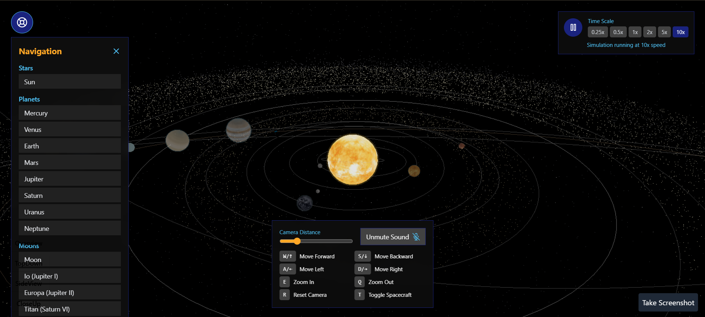

# CelestialNavigator

An interactive 3D solar system simulation built with React, Three.js, and React Three Fiber that provides an educational and visually stunning exploration of our celestial neighborhood.



## ✨ Features

- **Accurate Solar System Model**

  - Realistic planet orbits with proper Keplerian motion
  - Accurate size, rotation and orbital speed ratios
  - Detailed textures for all celestial bodies
  - Physically correct axial tilts and orbital eccentricity
- **Complete Celestial Catalog**

  - All planets of the Solar System
  - Major moons (Earth's Moon, Jupiter's Galilean moons, Saturn's Titan)
  - Dwarf planets (Pluto)
  - Asteroid Belt between Mars and Jupiter
  - Kuiper Belt and Oort Cloud
  - Saturn's rings with realistic tilt and orientation
- **Spacecraft and Human Elements**

  - International Space Station (ISS) in Low Earth Orbit
  - James Webb Space Telescope at L2
  - Realistic spacecraft models with proper trajectories
- **Interactive Experience**

  - Click on any celestial body to focus the camera
  - Detailed educational information panel for each object
  - Time controls to speed up, slow down, or pause the simulation
  - Camera controls for free navigation
- **Educational Value**

  - Scientific data and facts about each celestial body
  - Accurate orbital mechanics and physical properties
  - Visual representation of orbital dynamics

## 🛠️ Technologies

- **Frontend:**

  - React 18
  - TypeScript
  - Vite for fast development and optimal builds
  - TailwindCSS for styling
- **3D Rendering:**

  - Three.js
  - React Three Fiber
  - React Three Drei for enhanced components
- **State Management:**

  - Zustand for global state

## 🚀 Getting Started

### Prerequisites

- Node.js (v16+)
- npm or yarn

### Installation

1. Clone the repository

```bash
git clone https://github.com/gurr-i/CelestialNavigator.git
cd CelestialNavigator
```

2. Install dependencies

```bash
npm install
# or with yarn
yarn install
```

3. Run the development server

```bash
npm run dev
# or with yarn
yarn dev
```

4. Open your browser and navigate to `http://localhost:3000`

### Building for Production

```bash
npm run build
# or with yarn
yarn build
```

## 📝 Usage Guide

- **Navigation:**

  - Left-click and drag to rotate the view
  - Right-click and drag to pan the camera
  - Scroll to zoom in and out
  - Click on any celestial body to focus the camera on it
- **Controls:**

  - Use the time controls in the bottom bar to adjust simulation speed
  - The information panel opens when you select a celestial body
  - Reset the view with the Home button in the top right

## 🌟 Future Enhancements

- Mobile support with touch controls
- Mission planning and spacecraft orbit visualization
- Virtual reality support
- Solar system formation simulation
- Exoplanet exploration mode

## 🔗 Deployment

This project is deployed on GitHub Pages at: https://gurr-i.github.io/CelestialNavigator/

## 🤝 Contributing

Contributions are welcome! Please feel free to submit a Pull Request.

1. Fork the repository
2. Create your feature branch (`git checkout -b feature/AmazingFeature`)
3. Commit your changes (`git commit -m 'Add some AmazingFeature'`)
4. Push to the branch (`git push origin feature/AmazingFeature`)
5. Open a Pull Request

## 📄 License

This project is licensed under the MIT License - see the [LICENSE](LICENSE) file for details.

## 👏 Acknowledgements

- Textures from [Solar System Scope](https://www.solarsystemscope.com/textures/)
- Planetary data from [NASA](https://solarsystem.nasa.gov/)
- 3D models from [NASA 3D Resources](https://nasa3d.arc.nasa.gov/)
- Inspired by [Solar System WebGL Demo](https://projects.marpi.pl/solarSystem/)
